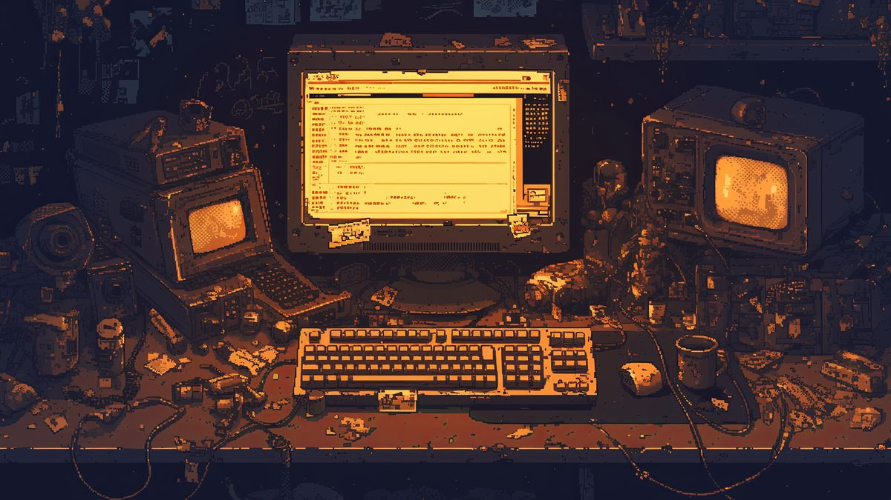

## Hi there 🧋

Lorem ipsum dolor sit amet, consectetur adipiscing elit. Donec feugiat venenatis placerat.🍙

Lorem ipsum dolor sit amet, consectetur adipiscing elit. Donec feugiat venenatis placerat. Suspendisse potenti. Sed rhoncus, sem sed cursus iaculis, leo dolor ultrices nisi, et sollicitudin nisi dui nec purus. Nullam et pulvinar magna. Proin cursus sed eros tempor ultricies. Suspendisse convallis ac risus at gravida. Lorem ipsum dolor sit amet, consectetur adipiscing elit. Cras faucibus pellentesque tortor quis iaculis. Vestibulum maximus metus ac auctor pretium.

  

🌱 I’m currently learning: 

        
        
        
        

<!--
**Yukpuffs/Yukpuffs** is a ✨ _special_ ✨ repository because its `README.md` (this file) appears on your GitHub profile.

Here are some ideas to get you started:

- 🔭 I’m currently working on ...
- 🌱 I’m currently learning ...
- 👯 I’m looking to collaborate on ...
- 🤔 I’m looking for help with ...
- 💬 Ask me about ...
- 📫 How to reach me: ...
- 😄 Pronouns: ...
- ⚡ Fun fact: ...
-->
